# COMQUTOR Alpha

### Evidence-first AI research infrastructure

COMQUTOR Alpha turns multi-agent research reports into a traceable system of
claims, evidence facts, causal structure, Alpha activations, and explicitly
admitted or rejected conflicts. The goal is not to produce an opaque trading
answer. The goal is to make every important research conclusion inspectable,
replayable, and auditable.

> **Project status:** research MVP for local/internal evaluation. COMQUTOR Alpha
> is a research-assistance and evidence-auditing system, not an automated
> trading system and not financial advice.


## Thirty-second overview

Large-language-model research systems can produce fluent conclusions without
making it easy to answer four engineering questions:

1. Which exact source claim supports this conclusion?
2. Is the evidence actually about this company and this causal mechanism?
3. Did repeated agent statements add new evidence, or merely duplicate one fact?
4. Why was a conflict admitted, suppressed, or rejected?

COMQUTOR Alpha adds a typed, testable structure layer downstream of
[TradingAgents](https://github.com/TauricResearch/TradingAgents). It preserves
the multi-agent research substrate while replacing answer-only consumption with
an evidence lineage and audit pipeline.

## System architecture

```mermaid
flowchart TD
    A["TradingAgents agent reports"] --> B["Structured claims + provenance"]
    B --> C["Alpha mapping + evidence stance"]
    C --> D["Evidence Fact dedup + Structure Graph"]
    D --> E["Activation scoring + conflict admissibility"]
    E --> F["FastAPI + SQLAlchemy persistence"]
    F --> G["React research, graph, and conflict UI"]
    E --> H["Replay, regression, and audit artifacts"]
```



One research run materializes a versioned chain of artifacts rather than only a
final narrative:

```text
raw_agent_outputs.json
  -> structured_agent_outputs.json
  -> evidence_facts.json
  -> alpha_matches.json
  -> structure_graph.json
  -> alpha_activations.json
  -> conflicts.json
  -> run_audit.json
```

The resulting lineage lets a reviewer move from a displayed conflict or Alpha
state back to its supporting evidence, source agent output, semantic decision,
and deterministic gate result.

## What I built

This repository deliberately separates the open-source foundation from my
original work:

- `tradingagents/` is the vendored/forked Apache-2.0 upstream research
  framework.
- `comqutor_alpha/` is the COMQUTOR-specific backend and research pipeline I
  built on top of it.
- `frontend/` is the React and TypeScript product interface for starting or
  reopening research runs, inspecting the Structure Graph, and reviewing main
  and candidate conflicts.
- `evaluation/`, `scripts/`, and the COMQUTOR test surface provide deterministic
  replay, regression evaluation, audit artifact generation, and delivery
  verification.

My work includes:

- converting free-form agent reports into structured claims with source
  provenance and explicit admission rules;
- implementing Alpha mapping, evidence-stance classification, ticker-specific
  evidence controls, and Evidence Fact deduplication;
- building the causal Structure Graph, activation scoring, entity-exposure
  gates, and conflict admissibility pipeline;
- designing Bull, Bear, Counter, Missing, and Invalidation evidence views without
  letting the presentation layer silently change semantic decisions;
- building FastAPI endpoints, SQLAlchemy persistence with SQLite/PostgreSQL
  support, and the React/TypeScript frontend;
- creating provider-free architecture replay, six-ticker regression, frozen
  evaluation sets, run-level manifests, and integrity checks.

The detailed upstream/local code boundary is documented in
[`README_DEV.md`](README_DEV.md) and
[`docs/license_boundary_report.md`](docs/license_boundary_report.md).

## Engineering decisions

| Concern | COMQUTOR approach |
| --- | --- |
| LLM semantics | Semantic judgments are versioned and recorded with method, confidence band, and provenance. |
| Deterministic authority | Thresholds, eligibility, fact grouping, activation levels, and conflict gates are enforced in code. |
| Evidence inflation | Near-duplicate claims are grouped into Evidence Facts before downstream counting. |
| Ticker relevance | Generic background and non-ticker-specific evidence are retained for audit but cannot silently satisfy stronger gates. |
| Failure behavior | Invalid schemas, broken lineage, unsupported persistence fields, and incomplete artifacts fail closed with reason codes. |
| Reproducibility | Historical raw inputs can be replayed through the current structure pipeline with zero Provider calls and without overwriting the source run. |
| Auditability | Each run exports a fixed artifact bundle with identity, hashes, stage outputs, and a self-consistency audit. |

## Product surface

The FastAPI service exposes health, readiness, Alpha-library, research-run,
agent-output, graph, and conflict endpoints. The frontend provides four primary
views:

- `/research` — create a research run and inspect recent runs;
- `/runs/:runId/research` — lifecycle, progress, and agent research output;
- `/runs/:runId/structure` — Alpha activations and the causal Structure Graph;
- `/runs/:runId/conflicts` — main, admitted, and candidate conflicts with their
  evidence and gate reasons.

Conflict review distinguishes presentation from decision authority:

- **Bull/Bear Evidence** includes only qualifying supporting Evidence Facts.
- **Counter Evidence** keeps explicit opposition and counter-Alpha routing.
- **Missing Evidence** reports the unmet deterministic admissibility conditions.
- **Qualification Gaps** are shown separately from evidence-content gaps.
- **Invalidation Conditions** are displayed only when product-approved content
  exists; missing approval is not replaced with fabricated text.

## Selected verification results

The repository keeps generated evidence next to the code so results can be
examined instead of accepted as résumé claims.

| Verification | Recorded result | Evidence |
| --- | ---: | --- |
| Frozen Blind Holdout #5 Alpha matching | 166/200 = **83.0%** | [`evidence_review_summary.json`](docs/audit_artifacts/evidence_review_summary.json) |
| Evidence polarity on materially fitting holdout rows | 52/62 = **83.87%** | [`evidence_review_summary.json`](docs/audit_artifacts/evidence_review_summary.json) |
| Six-ticker required artifact completeness | 54/54 = **100%** | [`item6_a2_artifact_completeness.json`](docs/audit_artifacts/item6_a2_artifact_completeness.json) |
| Provider-free replay artifact cases | 7/7 complete; source hashes unchanged | [`artifact_completeness_summary.json`](docs/audit_artifacts/artifact_completeness_summary.json) |

The semantic figures above are frozen evaluation results, not a claim of perfect
semantic accuracy. The repository also retains failed and superseded evaluation
rounds instead of rewriting history. Current limitations are stated below.

## Quick start: provider-free demo

Requirements: Python 3.10+, Node.js 22 LTS, npm, Git, and curl.

```bash
git clone --branch comqutor-structure-layer \
  https://github.com/XiangM7/COMQUTOR-Alpha-.git
cd COMQUTOR-Alpha-

python3 -m venv .venv
source .venv/bin/activate
python -m pip install -e ".[api,dev]"

cd frontend
npm ci
cd ..

./scripts/demo_offline.sh
```

The offline demo uses deterministic fixtures, disables live TradingAgents and
LLM execution, and starts the API and frontend without Provider credentials.

For manual development:

```bash
# Terminal 1: backend (SQLite fallback)
COMQUTOR_OUTPUT_DIR=outputs/runs \
COMQUTOR_CORS_ORIGINS=http://127.0.0.1:5175 \
.venv/bin/comqutor-api

# Terminal 2: frontend
cd frontend
npm run dev
```

Open `http://127.0.0.1:5175/research`.

See [`docs/installation_and_usage.md`](docs/installation_and_usage.md) for
PostgreSQL, environment variables, live-provider configuration, and additional
operations guidance.

## Replay and regression

Replay a historical run through the current downstream architecture without a
Provider call or source-run mutation:

```bash
python -m comqutor_alpha.replay --source-run-id <run_id>
```

Run the fixed six-ticker regression selection:

```bash
python scripts/run_regression.py --tickers NVDA QQQ MSFT SNDK TSM AMD
```

The regression report keeps expected/detected Alpha states, admitted versus
candidate conflicts, ticker consistency, graph size, evidence-fact counts, and
explicit failure reasons. See
[`a4_regression_runner_report.md`](docs/audit_artifacts/a4_regression_runner_report.md).

## Tests and delivery checks

```bash
# Backend, excluding external-service integration tests
.venv/bin/python -m pytest -m "not integration" -q

# PostgreSQL integration suite
.venv/bin/python -m pytest -m integration -q

# Frontend tests and production build
cd frontend
npm run test -- --run
npm run typecheck
npm run lint
npm run build
```

The GitHub Actions definition includes separate backend-offline, frontend, and
PostgreSQL integration jobs. Tests cover semantic contracts, graph integrity,
conflict admission, persistence round-trips, API adapters, lifecycle and retry
behavior, UI rendering, and provider-free replay.

## Repository map

```text
comqutor_alpha/
  api/                 FastAPI routes and artifact export
  structure_engine/    claim extraction, Alpha mapping, evidence stance
  graph_engine/        Evidence Facts, graph construction, activation
  conflict_engine/     admissibility, scoring, evidence UI contracts
  data_sanity/         numeric-claim and market-data checks
  exposure/            entity-to-Alpha exposure gates
  replay/              immutable architecture replay
  regression/          six-ticker evaluation contracts and reports
  storage/             SQLite/PostgreSQL repositories and migrations
frontend/              React + TypeScript research interface
evaluation/            versioned golden cases and policies
docs/                  design records, runbooks, audits, and QA evidence
tests/                 backend, integration, semantic, and persistence tests
```

## Current boundaries

- This is a local/internal research MVP, not a public multi-tenant service.
- Authentication, authorization, and tenant ownership are not implemented.
- Some Alpha invalidation content still awaits formal product approval.
- Live model and data-provider behavior remains non-deterministic; downstream
  Architecture Replay is deterministic only for frozen input artifacts.
- The system does not issue `BUY`/`SELL`/`HOLD` instructions, guarantee returns,
  or execute trades.

See [`docs/current_system_state.md`](docs/current_system_state.md) and
[`docs/release_candidate_manifest.md`](docs/release_candidate_manifest.md) for
the detailed engineering status and release boundary.

## Attribution and license

COMQUTOR Alpha extends
[TauricResearch/TradingAgents](https://github.com/TauricResearch/TradingAgents),
which is distributed under the Apache License 2.0. Upstream attribution and the
repository license are preserved. COMQUTOR-specific architecture and code are
isolated additively as described above and in the license boundary report.

This project is for research and engineering evaluation only. It is not
financial, investment, or trading advice.

