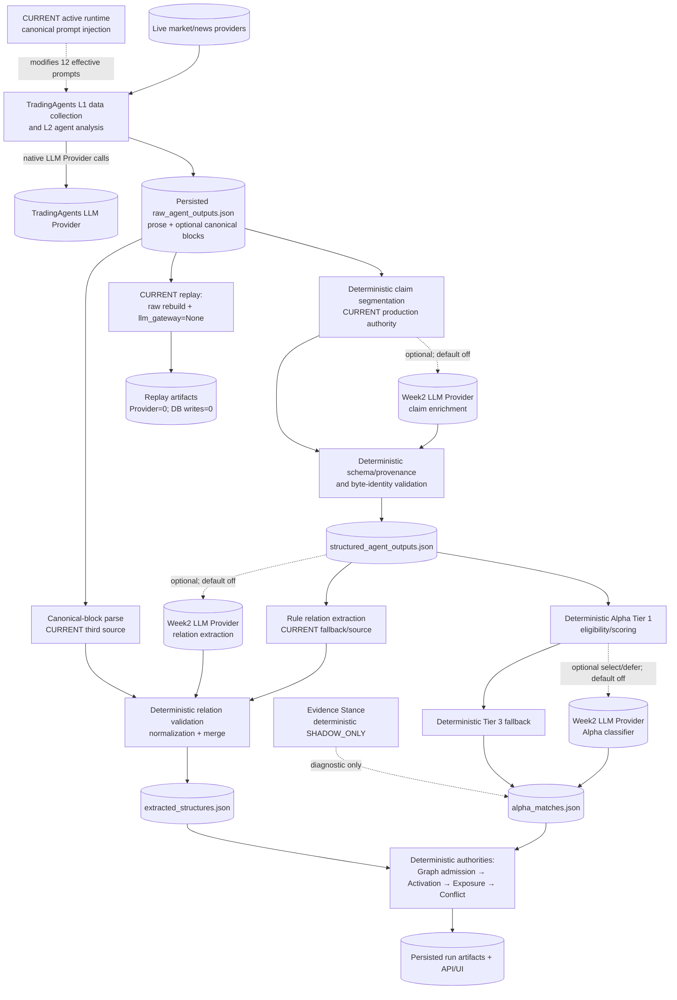
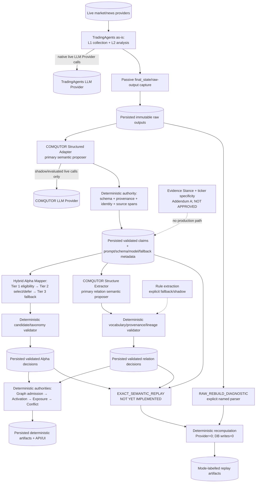

# Current vs Target Semantic Architecture

## Status

- Current diagram: `CURRENT_IMPLEMENTATION`
- Target diagram: `APPROVED_PROJECT_DECISION`, not yet implemented
- Production behavior changed by this document: No

## CURRENT

Current boundary notes:

- Solid Provider edges are possible only during live execution. Week2 Provider edges are optional and gated by `COMQUTOR_WEEK2_LLM_ENABLED`, which defaults off.
- `comqutor_alpha/llm/canonical_prompt_injection.py` adds no call but actively changes TradingAgents prompt/output behavior.
- Graph admission, Activation, Exposure calculation, Conflict, identity, and serialization remain deterministic authorities.
- Current replay is Provider-zero but is only `RAW_REBUILD_DIAGNOSTIC`-like for LLM-influenced semantic decisions.

## TARGET

Target boundary notes:

- Canonical prompt injection is absent from target semantic authority, but its actual runtime disablement is deferred to a measured Phase 4 migration.
- Every LLM result is a proposal until deterministic validation accepts it.
- Rule semantics remain explicit fallback/shadow paths rather than silently co-equal primary authority.
- Validated semantic decisions and execution metadata are persisted before exact replay becomes available.
- `EXACT_SEMANTIC_REPLAY`, explicit `RAW_REBUILD_DIAGNOSTIC`, semantic-call persistence, and the Addendum A path are not yet implemented.
